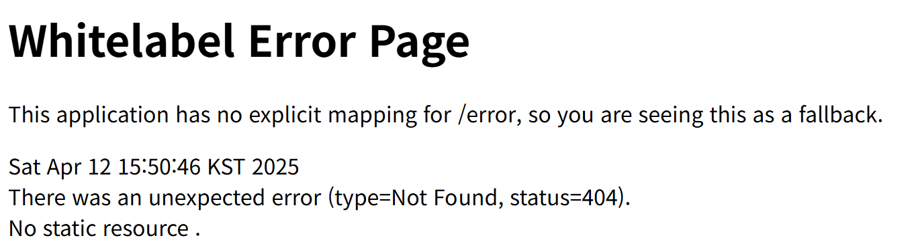

# 스프링 부트 프로젝트 구조

### templates 디렉터리

src/main/resources 디렉터리의 하위 디렉터리로 템플릿 파일들을 저장 

템플릿 파일은 자바 코드를 삽입할 수 있는 HTML 파일 
ex. 질문 목록, 질문 상세 등 HTML 파일 

 

### static 디렉터리  

sbb 프로젝트의 스타일시트(css 파일), 자바스크립트(js 파일), 이미지 파일(jpg 파일, png 파일) 등을 저장 

### application.properties 파일 

sbb 프로젝트의 환경을 설정 

### build.gradle 파일  

그레이들이 사용하는 환경 파일 
그레이: 그루비(Groovy)를 기반으로 한 빌드 도구  
프로젝트에 필요한 플러그인과 라이브러리를 설치하기 위한 내용을 작성함 

### URL 매핑과 컨트롤러 

 

http://localhost:8080/sbb 페이지를 요청하면 이와 같이 오류를 알리는 화면이 등장함 
404는 HTTP 오류 코드 중 하나로, 브라우저가 요청한 페이지를 찾을 수 없다는 의미임 이러한 오류를 해결하기 위해
컨트롤러에 /sbb URL 매핑을 찾고, 발견 시 URL 매핑과 연결된 매서드를 실행함

 

`package devtools.springboot;`

`import org.springframework.stereotype.Controller;`
`import org.springframework.web.bind.annotation.GetMapping;`

`import java.sql.SQLOutput;`

` @Controller`
`public class MainController {`
`@GetMapping("/sbb")`
`public void index() {`
`System.out.println("index");`
`return "안녕하세요 sbb에 오신 것을 환영합니다.";`
`}`
`}`

 
MainController 클래스에 @Controller 애너테이션을 적용하면 스프링 부트의 컨트롤러가 됨 
index 매서드의 @GetMapping 애너테이션은 요청된 URl(/sbb)과의 매핑을 담당함

 

중요한 점은 URL과 매핑된 매서드는 반드시 결과값을 리턴해야 한다는 점임  
예를 들어, "안녕하세요 sbb에 오신 것을 환영합니다"처럼
클라이언트(브라우저)로 응답을 리턴함 
