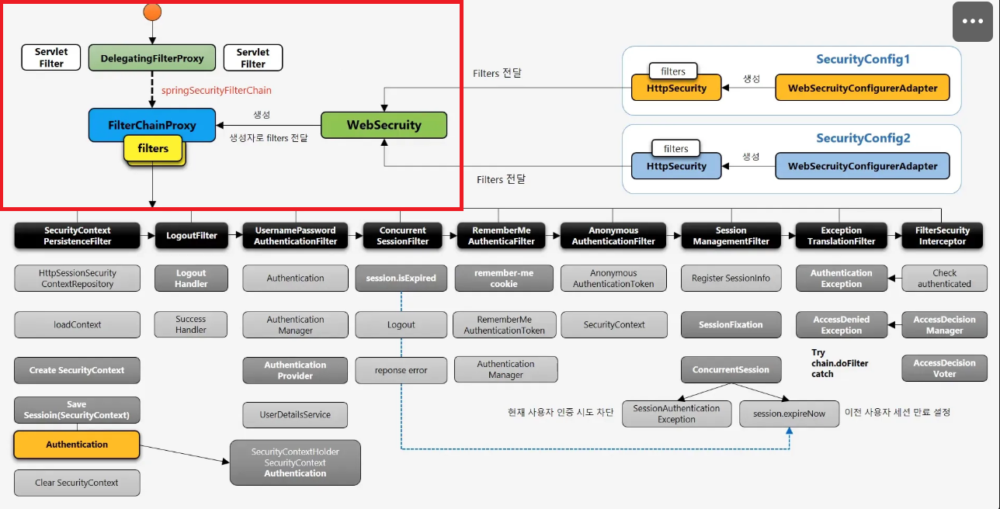
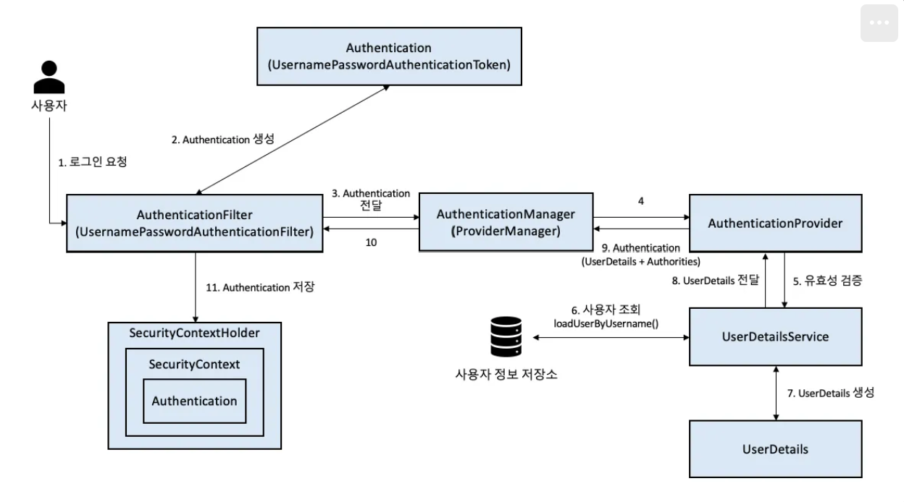

## 시큐리티

### filter chain 

WAS(와스)와 같은 웹 애플리케이션 서버에서 제공하는 Servlet Filter 체인 
클라이언트 요청이 들어오면, 여러 개의 필터들이 순차적으로 요청(Request)을 가로채거나 수정 또는 검증할 수 있게 해줌 
요청 전 후 처리(로깅,인코딩 설정,보안 검사)를 위해 사용함 

### Security FilterChain 

Spring Security가 동작하기 위해 별도로 구성한 보안 필터 체인 
FilterChainProxy가 이에 해당함 
FilterChainProxy 안에는 여러 개의 Security 관련 필터들(SecurityContextPersistenceFilter,UsernamePasswordAuthenticationFilter,ExceptionTranslationFilter 등 )이이 순서대로 등록되어 있음 즉 시큐리티 필터 체인은 인증(Authentication), 인가(Authorization),세션 관리(Session Management) 같은 보안 처리에만 특화됨 

ex. 

- 로그인 해야 볼 수 있는 페이지
- 관리자인 경우만 접근할 수 있는 기능 
   

- ### Spirng Security 기반 사용자 웹 요청 시 처리되는 흐름 
   
  ⭐ **처음 Form 인증 시도하는 경우** 

1. WAS(ex.Tomcat)가 부팅될 때 DelegatingFilterProxy를 자동으로 등록해줌 
2. 클라이언트가 로그인을 하려고 요청을 보냄 
3. WAS가 DelegatingFilterProxy를 호출하고 Spring context(Spring이 관리하는 Bean과 같은 객체 집합) 안에 있는
   FilterChainProxy라는 필터 체인에게 요청을 넘겨 Spring Security 필터들을 호출함 
4. Security Context에 사용자의 Authentication 객체 담아서 SecurityContextHolder로 시큐리티 컨텍스트를 감싼 뒤 저장 
5. UsernamePasswordAuthenticationFilter -> SecurityContextHolder.getContext().getAuthentication()를 통해 사용자의 인증 객체를 얻어 AuthenicationManager에게 인증 요청 
6. AuthenticationManager는 AuthenticationProvider에게
   실제 인증 처리 위임 
7. AuthenticationProvider로 부터 받은 인증 성공 여부 반환 
8. SessionManagementFilter ->인증 성공한 사용자의 Session 등록 

⭐**이미 인증이 수행된 동일한 계정으로 인증 시도하는 경우** 

1. 사용자가 서버에 접근(localhost:8080/) 
2. 위와 같이 Form 인증을 동일한 계정으로 수행 
3. SessionManagementFilter-> ConcurrentSession 존재하는 경우 아래와 같은 두가지 전략으로 처리 

- (1) SessionAuthenticationException :새로운 인증 시도 차단 
- (2) session.expireNow() : 이전 사용자 세션 만료 

 

**WAS(Web Application Server)란?** 
웹 애플리케이션 서버로 웹 브라우저에서 오는 요청을 받아, 비즈니스 로직(코드)을 실행하고 결과를 웹 페이지로 만들어
응답하는 서버

 

- 사용자가 웹브라우저(chrome)를 통해 서버에 요청을 보냄(ex.로그인, 게시글 보기) 
- WAS는 웹 어플리케이션(spring,JSP 등)을 구동시켜서 요청을 처리함 
- 요청 처리 결과(HTML,JSON)을 만들어 다시 사용자에게 응답 

- **[참고] WAF(Web Application Firewall)** 
  WAF는 웹 어플리케이션을 SQL 인젝션, 크로스 사이트 스크립팅(XSS), 파입 업로드 공격 등과 같은 웹 기반 공격으로부터 보호해주는 보안 장치  
  HTTP/HTTPS 요청 내용을 분석해서 웹 서버로 도달하기 전 악성 요청을 차단함

   

 

### 인증과 인가

- **인증** 
  사용자가 누구인지 확인하는 절차 
  로그인할 때 아이디와 비밀번호를 입력 
  맞으면 "이 사람은 홍길동이 맞다!라고 인정하는 것 
  `UserDetails loadUserByUsername(String username)` 
- **인가** 
  인증된 사용자에게 특정 기능/자원에 접근 권한이 있는지 확인하는 절차 
  관리자만 들어갈 수 있는 /admin 페이지 
  일반 사용자는 접근이 불가능함 
  `.authorizeHttpRequests(auth -> 
    auth.requestMatchers("/admin/**").hasRole("ADMIN")
)`

 

스프링 시큐리티 권한 코드는 항상 "ROLE\_"로 시작해야 함 

| hasRole(String)      | 사용자가 주어진 역할이 있다면 접근을 인가(허용) | hasRole(”USER”) == hasAuthority(”ROLE_USER”) |
| -------------------- | ----------------------------------------------- | -------------------------------------------- |
| hasAuthority(String) | 사용자가 주어진 권한이 있다면 접근을 인증(허용) | hasAuthority(”ROLE_USER”)                    |

 

### (추가)권한 매서드  

| .authenticated( ) | 로그인한 사용자만 허용 |
| ----------------- | ---------------------- |
| .permitAll( )     | 누구나 허용            |
| .denyAll( )       | 모두 차단              |
